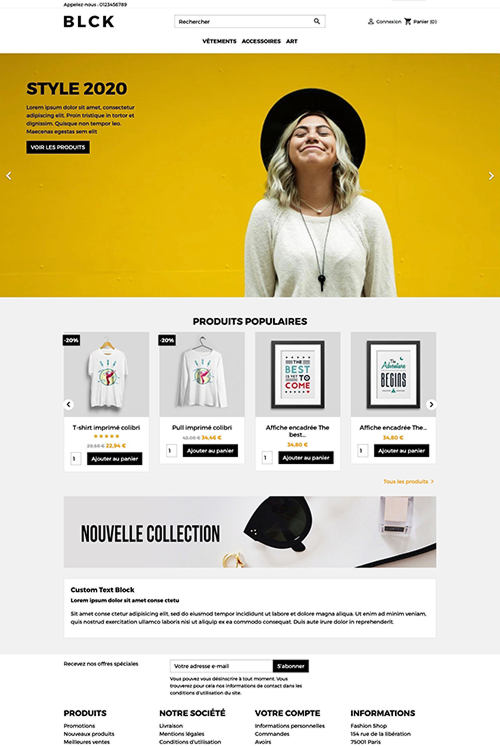

# BLCK - PrestaShop Theme

**A modern, minimal and performant PrestaShop 1.7 / 8 / 9 theme with advanced color customization**

[English](#english) • [Français](#français)

---

## English

### About

**BLCK** is a sophisticated, modern PrestaShop theme designed for businesses that value simplicity, performance, and customization. The theme features a clean, minimalist aesthetic with a powerful configuration module that allows merchants to personalize colors, fonts, and button styles without any coding knowledge.

#### Key Features:
- 🎨 **Advanced Color Customization** - Configure primary and secondary colors, backgrounds, button styles, and flag colors
- 🔤 **Font Selection** - Choose from system fonts for titles and body text
- 📱 **Responsive Design** - Fully responsive across all devices and screen sizes
- ⚡ **High Performance** - Optimized CSS and JavaScript for fast loading times
- 🔧 **Easy Configuration** - Intuitive admin panel with built-in BLCK Config module
- 📐 **Multiple Layouts** - Support for full-width, two-column, and three-column layouts
- 🛍️ **Complete E-commerce Features** - Ready for product sales with modern UX patterns

### Author

**Latoutfrancais - Arnaud Merigeau**

- 🌐 Website: [www.arnaud-merigeau.fr](https://www.arnaud-merigeau.fr)

### Compatibility

#### PrestaShop Versions
- ✅ **PrestaShop 1.7** (1.7.0.0 to 1.7.8.x)
- ✅ **PrestaShop 8** (8.0.0 to 8.x.x)
- ✅ **PrestaShop 9** (9.0.0+)

The BLCK theme is fully compatible with all PrestaShop versions from 1.7.0.0 onwards.

#### System Requirements
- **PHP:** 7.0 or higher (PHP 8.0+ recommended for PrestaShop 8 and 9)
- **Modern Web Browser:** JavaScript enabled required
- **Disk Space:** Approximately 20 MB for theme and module installation

### Installation

#### Requirements
- PrestaShop 1.7, PrestaShop 8 and PrestaShop 9
- PHP 7.0 or higher
- Modern web browser with JavaScript enabled

#### Step-by-Step Installation

1. **Download the BLCK.ZIP file**
   - Obtain the `blck.zip` file containing the complete BLCK theme

2. **Upload ZIP file to your PrestaShop installation**
   - Log in to your PrestaShop admin panel
   - Navigate to **Appearance** → **Themes**
   - Click on **Add a new theme**
   - Upload the `blck.zip` file using the file upload interface
   - PrestaShop will automatically extract and install the theme

3. **Activate the theme**
   - After successful upload, the BLCK theme will appear in your theme list
   - Click **Use this theme** to activate it
   - The theme will be set as the active theme for your store

4. **Verify installation**
   - Your store frontend should now display the BLCK theme
   - Check that the theme assets (CSS, JS) are loading correctly
   - Navigate through a few pages to ensure everything is working properly

5. **Module installation confirmation**
   - The theme automatically installs the BLCK Config module during activation
   - Go to **Modules and Services** and search for **"BLCK config"**
   - Verify the module is listed and marked as installed
   - If not installed automatically, click **Install** on the BLCK config module card

#### Alternative: Manual Installation from ZIP

If you prefer to extract and upload manually:

1. Extract the `blck.zip` file on your computer
2. Upload the extracted `blck` folder to `/themes/` directory via FTP
3. Log in to PrestaShop admin
4. Go to **Appearance** → **Themes**
5. Find "BLCK" and click **Use this theme**

### Module BLCK Configuration

The **BLCK Config** module is the heart of the theme customization system. It provides a user-friendly interface to customize every aspect of your store's appearance.

#### How to Access Configuration

1. Navigate to **Modules and Services** in the admin panel
2. Search for **"BLCK config"**
3. Click **Configure** on the module card
4. You'll be taken to the BLCK configuration form

#### Configuration Options

The module allows you to customize the following settings:

##### 🔤 Fonts Section
- **Title Font** - Select the font family for all headings (h1, h2, h3, etc.)
- **Text Font** - Select the font family for body text and paragraphs

Available font options:
- Arial
- Verdana
- Tahoma
- Trebuchet MS
- Times New Roman
- Georgia
- Garamond
- Courier New
- Brush Script MT

##### 🎨 Colors Section

**Main Colors:**
- **Main Color** - The primary color used throughout the theme
- **Secondary Color** - Accent color for highlights and secondary elements
- **Background Color** - Page background color

**Primary Button Styling:**
- **Primary Button Background** - Background color for primary action buttons
- **Primary Button Text** - Text color for primary buttons
- **Primary Button Background (Hover)** - Background on hover state
- **Primary Button Text (Hover)** - Text color on hover state

**Secondary Button Styling:**
- **Secondary Button Background** - Background color for secondary action buttons
- **Secondary Button Text** - Text color for secondary buttons
- **Secondary Button Background (Hover)** - Background on hover state
- **Secondary Button Text (Hover)** - Text color on hover state

**Flag Styling:**
- **Flag Background** - Background color for flags/badges
- **Flag Text** - Text color for flags/badges

#### Default Colors

The module ships with the following default color scheme:

| Element | Color |
|---------|-------|
| Main Color | #000000 (Black) |
| Secondary Color | #fba000 (Orange) |
| Background Color | #f6f6f6 (Light Gray) |
| Primary Button Background | #000000 (Black) |
| Primary Button Text | #FFFFFF (White) |
| Secondary Button Background | #F6F6F6 (Light Gray) |
| Secondary Button Text | #000000 (Black) |
| Flag Background | #000000 (Black) |
| Flag Text | #FFFFFF (White) |

#### Applying Configuration Changes

1. Modify any of the settings in the BLCK Config panel
2. Click the **Save** button at the bottom of the form
3. The theme CSS variables are automatically updated
4. Changes appear immediately on the frontend (may require cache clearing)

#### Technical Details

The BLCK Config module works by:
1. Storing configuration values in the PrestaShop Configuration table
2. Generating a dynamic CSS file with CSS variables (custom properties)
3. Loading this CSS file on all frontend pages
4. The theme uses these CSS variables to style all elements

**Generated CSS file location:** `/modules/blckconfig/blck.css`

#### Common Customization Scenarios

**Dark Mode Theme:**
- Main Color: #FFFFFF (White)
- Secondary Color: #FF9500 (Orange)
- Background Color: #1a1a1a (Dark Gray)
- Adjust button colors accordingly

**Corporate Blue Theme:**
- Main Color: #003366 (Navy Blue)
- Secondary Color: #0099FF (Light Blue)
- Background Color: #F0F5FA (Light Blue Gray)
- Primary Button Background: #003366

**Pastel Theme:**
- Main Color: #8B5A8E (Purple)
- Secondary Color: #F5A9D0 (Pink)
- Background Color: #FFF5F9 (Light Pink)
- Adjust text colors for readability

---

## Français

### À propos

**BLCK** est un thème PrestaShop sophistiqué et moderne, conçu pour les entreprises qui valorisent la simplicité, la performance et la personnalisation. Le thème offre une esthétique épurée et minimaliste, accompagnée d'un puissant module de configuration qui permet aux marchands de personnaliser les couleurs, les polices et les styles de boutons sans aucune connaissance en codage.

#### Caractéristiques principales :
- 🎨 **Personnalisation avancée des couleurs** - Configurez les couleurs primaires et secondaires, les arrière-plans, les styles de boutons et les couleurs des badges
- 🔤 **Sélection de polices** - Choisissez parmi les polices système pour les titres et le corps du texte
- 📱 **Design réactif** - Entièrement réactif sur tous les appareils et tailles d'écran
- ⚡ **Haute performance** - CSS et JavaScript optimisés pour des temps de chargement rapides
- 🔧 **Configuration facile** - Panneau d'administration intuitif avec module BLCK Config intégré
- 📐 **Dispositions multiples** - Support pour les dispositions pleine largeur, deux colonnes et trois colonnes
- 🛍️ **Fonctionnalités e-commerce complètes** - Prêt pour la vente de produits avec des modèles UX modernes

### Auteur

**Latoutfrancais - Arnaud Merigeau**

- 🌐 Site web : [www.arnaud-merigeau.fr](https://www.arnaud-merigeau.fr)

### Compatibilité

#### Versions PrestaShop
- ✅ **PrestaShop 1.7** (1.7.0.0 à 1.7.8.x)
- ✅ **PrestaShop 8** (8.0.0 à 8.x.x)
- ✅ **PrestaShop 9** (9.0.0+)

Le thème BLCK est entièrement compatible avec toutes les versions de PrestaShop à partir de 1.7.0.0.

#### Configuration système requise
- **PHP :** 7.0 ou supérieur (PHP 8.0+ recommandé pour PrestaShop 8 et 9)
- **Navigateur web moderne :** JavaScript requis
- **Espace disque :** Environ 20 Mo pour l'installation du thème et du module

### Installation

#### Prérequis
- PrestaShop 1.7, PrestaShop 8 et PrestaShop 9
- PHP 7.0 ou supérieur
- Navigateur web moderne avec JavaScript activé

#### Installation étape par étape

1. **Télécharger le fichier BLCK.ZIP**
   - Obtenir le fichier `blck.zip` contenant le thème BLCK complet

2. **Téléverser le fichier ZIP sur votre installation PrestaShop**
   - Connectez-vous au panneau d'administration PrestaShop
   - Accédez à **Apparence** → **Thèmes**
   - Cliquez sur **Ajouter un nouveau thème**
   - Téléversez le fichier `blck.zip` en utilisant l'interface de téléversement
   - PrestaShop extraira et installera automatiquement le thème

3. **Activer le thème**
   - Après le téléversement réussi, le thème BLCK apparaîtra dans votre liste de thèmes
   - Cliquez sur **Utiliser ce thème** pour l'activer
   - Le thème sera défini comme thème actif de votre magasin

4. **Vérifier l'installation**
   - Votre vitrine devrait maintenant afficher le thème BLCK
   - Vérifiez que les ressources du thème (CSS, JS) se chargent correctement
   - Naviguez sur quelques pages pour vous assurer que tout fonctionne correctement

5. **Confirmation de l'installation du module**
   - Le thème installe automatiquement le module BLCK Config lors de son activation
   - Allez à **Modules et services** et recherchez **« BLCK config »**
   - Vérifiez que le module est listé et marqué comme installé
   - Si non installé automatiquement, cliquez sur **Installer** sur la carte du module BLCK config

#### Alternative : Installation manuelle à partir du ZIP

Si vous préférez extraire et téléverser manuellement :

1. Extrayez le fichier `blck.zip` sur votre ordinateur
2. Téléversez le dossier `blck` extrait vers le répertoire `/themes/` via FTP
3. Connectez-vous à l'administration PrestaShop
4. Allez à **Apparence** → **Thèmes**
5. Trouvez « BLCK » et cliquez sur **Utiliser ce thème**

### Configuration du module BLCK

Le module **BLCK Config** est le cœur du système de personnalisation du thème. Il fournit une interface conviviale pour personnaliser chaque aspect de l'apparence de votre magasin.

#### Comment accéder à la configuration

1. Accédez à **Modules et services** dans le panneau d'administration
2. Recherchez **« BLCK config »**
3. Cliquez sur **Configurer** sur la carte du module
4. Vous serez redirigé vers le formulaire de configuration BLCK

#### Options de configuration

Le module vous permet de personnaliser les paramètres suivants :

##### 🔤 Section Polices
- **Police des titres** - Sélectionnez la famille de polices pour tous les en-têtes (h1, h2, h3, etc.)
- **Police du texte** - Sélectionnez la famille de polices pour le texte du corps et les paragraphes

Polices disponibles :
- Arial
- Verdana
- Tahoma
- Trebuchet MS
- Times New Roman
- Georgia
- Garamond
- Courier New
- Brush Script MT

##### 🎨 Section Couleurs

**Couleurs principales :**
- **Couleur principale** - La couleur primaire utilisée dans tout le thème
- **Couleur secondaire** - Couleur d'accent pour les mises en évidence et les éléments secondaires
- **Couleur d'arrière-plan** - Couleur d'arrière-plan de la page

**Style des boutons primaires :**
- **Arrière-plan du bouton primaire** - Couleur d'arrière-plan des boutons d'action primaires
- **Texte du bouton primaire** - Couleur du texte des boutons primaires
- **Arrière-plan du bouton primaire (survol)** - Arrière-plan à l'état survol
- **Texte du bouton primaire (survol)** - Couleur du texte au survol

**Style des boutons secondaires :**
- **Arrière-plan du bouton secondaire** - Couleur d'arrière-plan des boutons d'action secondaires
- **Texte du bouton secondaire** - Couleur du texte des boutons secondaires
- **Arrière-plan du bouton secondaire (survol)** - Arrière-plan à l'état survol
- **Texte du bouton secondaire (survol)** - Couleur du texte au survol

**Style des badges :**
- **Arrière-plan du badge** - Couleur d'arrière-plan des badges/drapeaux
- **Texte du badge** - Couleur du texte des badges/drapeaux

#### Couleurs par défaut

Le module est fourni avec le schéma de couleurs par défaut suivant :

| Élément | Couleur |
|---------|---------|
| Couleur principale | #000000 (Noir) |
| Couleur secondaire | #fba000 (Orange) |
| Couleur d'arrière-plan | #f6f6f6 (Gris clair) |
| Arrière-plan du bouton primaire | #000000 (Noir) |
| Texte du bouton primaire | #FFFFFF (Blanc) |
| Arrière-plan du bouton secondaire | #F6F6F6 (Gris clair) |
| Texte du bouton secondaire | #000000 (Noir) |
| Arrière-plan du badge | #000000 (Noir) |
| Texte du badge | #FFFFFF (Blanc) |

#### Application des modifications de configuration

1. Modifiez l'un des paramètres du panneau BLCK Config
2. Cliquez sur le bouton **Enregistrer** en bas du formulaire
3. Les variables CSS du thème sont automatiquement mises à jour
4. Les modifications apparaissent immédiatement sur le frontend (peut nécessiter un vidage du cache)

#### Détails techniques

Le module BLCK Config fonctionne en :
1. Stockant les valeurs de configuration dans la table Configuration de PrestaShop
2. Générant un fichier CSS dynamique avec des variables CSS (propriétés personnalisées)
3. Chargeant ce fichier CSS sur toutes les pages du frontend
4. Le thème utilise ces variables CSS pour styliser tous les éléments

**Emplacement du fichier CSS généré :** `/modules/blckconfig/blck.css`

#### Scénarios de personnalisation courants

**Thème mode sombre :**
- Couleur principale : #FFFFFF (Blanc)
- Couleur secondaire : #FF9500 (Orange)
- Couleur d'arrière-plan : #1a1a1a (Gris foncé)
- Ajustez les couleurs des boutons en conséquence

**Thème bleu professionnel :**
- Couleur principale : #003366 (Bleu marine)
- Couleur secondaire : #0099FF (Bleu clair)
- Couleur d'arrière-plan : #F0F5FA (Gris bleu clair)
- Arrière-plan du bouton primaire : #003366

**Thème pastel :**
- Couleur principale : #8B5A8E (Mauve)
- Couleur secondaire : #F5A9D0 (Rose)
- Couleur d'arrière-plan : #FFF5F9 (Rose clair)
- Ajustez les couleurs du texte pour la lisibilité

---

## License

This theme is provided as-is for use with PrestaShop. Please refer to the license files included in the theme directory for more information.

Ce thème est fourni tel quel pour une utilisation avec PrestaShop. Veuillez consulter les fichiers de licence inclus dans le répertoire du thème pour plus d'informations.

---

## Support

For support, questions, or bug reports, please visit:

**Latoutfrancais - Arnaud Merigeau**
- Website: [www.arnaud-merigeau.fr](https://www.arnaud-merigeau.fr)

Pour l'assistance, les questions ou les rapports de bugs, veuillez visiter :

**Latoutfrancais - Arnaud Merigeau**
- Site web : [www.arnaud-merigeau.fr](https://www.arnaud-merigeau.fr)

---

**BLCK Theme** © 2024 Latoutfrancais - Arnaud Merigeau. All rights reserved.

Made with ❤️ for the PrestaShop community

